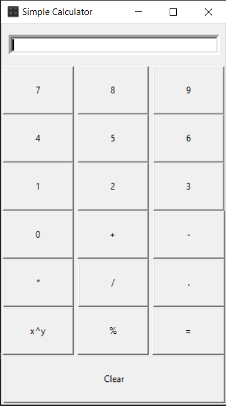
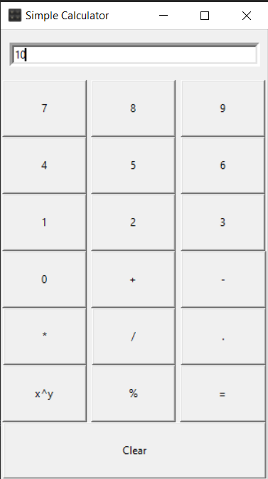

# GUI-Calculator
 GUI based simple calculator using the Python Tkinter module, which can perform basic arithmetic operations addition, subtraction, multiplication, division percentage and power.

## Setup

#### Clone

```
git clone https://github.com/neelangshu007/GUI-Calculator.git
```

#### Installation
```
pip install tkinter
```

#### Usage

If you have the correct version of Python and tkinter installed, you can run the program in the command prompt / terminal.
```
cd Weather-App
```
```
python main.py
```
**Note:** If you're using Python 3, replace the command "python" with "python3.8.3"

## Contributing

Pull requests are welcome. For major changes, please open an issue first to discuss what you would like to change.

Please make sure to update tests as appropriate.

### Contribution Steps
1. Fork it
2. Create your feature branch (git checkout -b my-new-feature)
3. Commit your changes (git commit -m 'Add some feature')
4. Push your branch (git push origin my-new-feature)
5. Create a new Pull Request


 # GUI Calculator Screenshots
 
  
 
